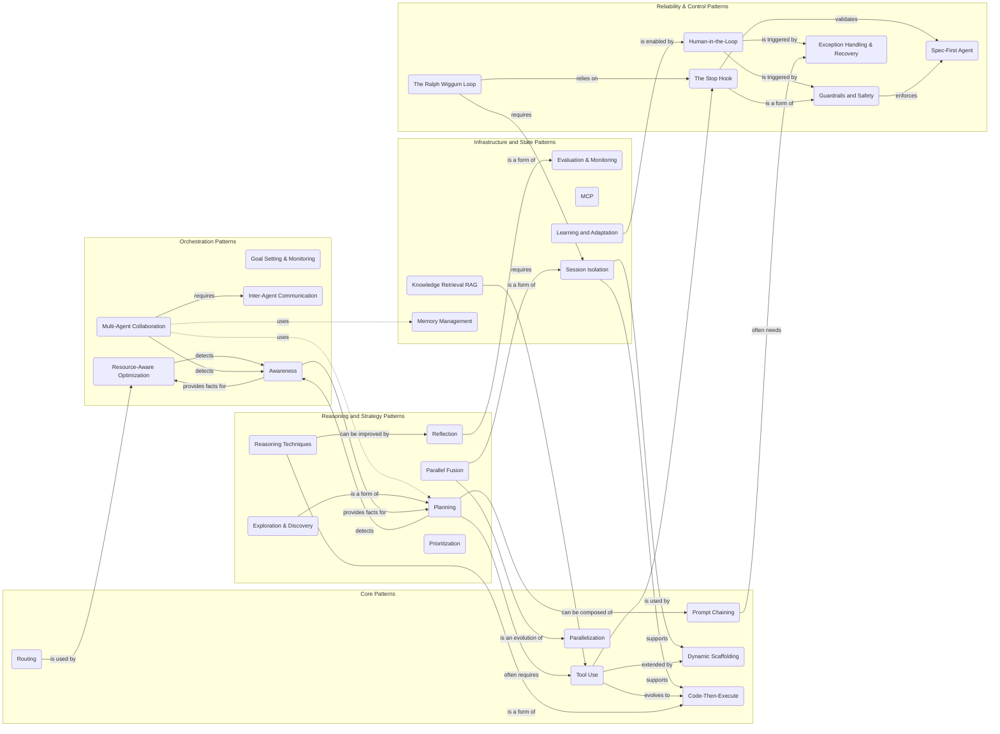

# From Generative to Agentic AI: Practical Patterns for Real-World Intelligent Systems

Workshop materials from **Geek Girls Portugal Conference 2026** · Porto Business School · April 2026

A hands-on introduction to agentic AI systems that can reason, plan, and act.  
Based on [*Agentic Design Patterns: A Hands-On Guide to Building Intelligent Systems*](https://www.amazon.com/) by **Antonio Gulli**.

---

## Implemented Patterns

Each pattern is available in two frameworks — Google ADK and LangGraph — so you can compare approaches side by side.

| Pattern | Google ADK | LangGraph |
|---|---|---|
| Prompt Chaining | [google_adk_patterns/prompt_chaining.py](google_adk_patterns/prompt_chaining.py) | [langgraph_patterns/prompt_chaining.py](langgraph_patterns/prompt_chaining.py) |
| Routing | [google_adk_patterns/routing.py](google_adk_patterns/routing.py) | [langgraph_patterns/routing.py](langgraph_patterns/routing.py) |
| Tool Use | [google_adk_patterns/tool_use.py](google_adk_patterns/tool_use.py) | [langgraph_patterns/tool_use.py](langgraph_patterns/tool_use.py) |
| Reflection | [google_adk_patterns/reflection.py](google_adk_patterns/reflection.py) | [langgraph_patterns/reflection.py](langgraph_patterns/reflection.py) |
| Multi-Agent | [google_adk_patterns/multi_agent.py](google_adk_patterns/multi_agent.py) | [langgraph_patterns/multi_agent.py](langgraph_patterns/multi_agent.py) |
| Human-in-the-Loop | [google_adk_patterns/hitl.py](google_adk_patterns/hitl.py) | [langgraph_patterns/hitl.py](langgraph_patterns/hitl.py) |
| Guardrails and Safety | [google_adk_patterns/guardrails.py](google_adk_patterns/guardrails.py) | [langgraph_patterns/guardrails.py](langgraph_patterns/guardrails.py) |

---

## All 29 Patterns

### Core Patterns
- Prompt Chaining
- Routing
- Parallelization
- Tool Use
- Code-Then-Execute
- Dynamic Scaffolding

### Reasoning and Strategy Patterns
- Reflection
- Planning
- Reasoning Techniques
- Parallel Fusion
- Prioritization
- Exploration & Discovery

### Orchestration Patterns
- Multi-Agent Collaboration
- Goal Setting & Monitoring
- Inter-Agent Communication
- Awareness
- Resource-Aware Optimization

### Infrastructure and State Patterns
- Memory Management
- Learning and Adaptation
- Model Context Protocol (MCP)
- Knowledge Retrieval (RAG)
- Evaluation & Monitoring
- Session Isolation

### Reliability & Control Patterns
- The Stop Hook
- Exception Handling & Recovery
- Human-in-the-Loop
- The Ralph Wiggum Loop
- Guardrails and Safety
- Spec-First Agent

---

## Pattern Relationships

The following diagram illustrates how different agentic patterns often connect and rely on each other. Source: [https://github.com/zeljkoavramovic/agentic-design-patterns/tree/main]



---

## Getting Started

```bash
git clone https://github.com/lpsantao/agentic_geekgirls.git
cd agentic_geekgirls
pip install -r requirements.txt
```

Copy the env template and fill in your API keys:

```bash
cp .env_template .env
```

| Variable | Where to get it |
|---|---|
| `GOOGLE_API_KEY` | [Google AI Studio](https://aistudio.google.com/app/apikey) |
| `OPENAI_API_KEY` | [OpenAI Platform](https://platform.openai.com/api-keys) |

Run any pattern directly, e.g.:

```bash
python google_adk_patterns/prompt_chaining.py
python langgraph_patterns/prompt_chaining.py
```

### Gmail Setup (Multi-Agent pattern only)

The `multi_agent.py` examples send real emails via the Gmail API and require a one-time OAuth setup:

1. Go to [Google Cloud Console](https://console.cloud.google.com/) → enable the **Gmail API**
2. Create **OAuth 2.0 Desktop** credentials and download as `credentials.json` into the project root
3. Run the script once — a browser window will open for consent and `token.pickle` will be created automatically

> `credentials.json` and `token.pickle` are gitignored and should never be committed.

---

## About the Workshop

This workshop explores the shift from single-prompt generative AI to agentic systems — covering the key patterns used in modern AI products through guided examples and a collaborative design exercise.

**Presented by:** Liliana Antão · [Medtiles](https://med.tiles-ai.com) · [LinkedIn](https://linkedin.com/in/lilianaantao)
